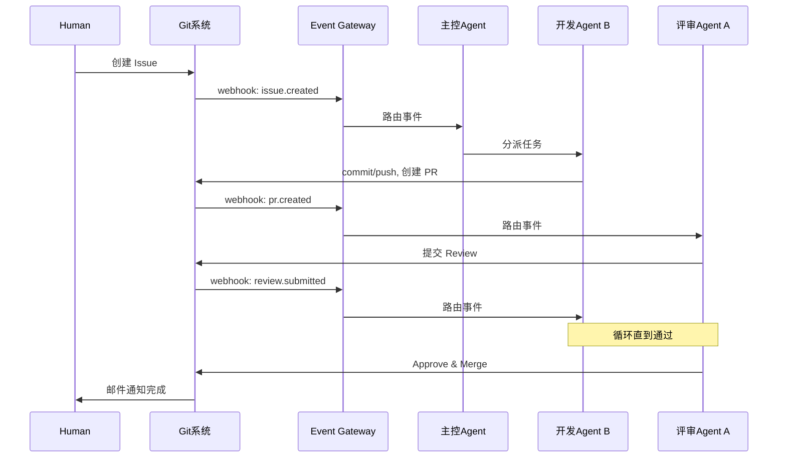

# NANA-OS Event Gateway 设计文档

> 状态：Draft  
> 日期：2026-03-05  
> 目的：与 DiAgent 团队对齐事件驱动多智能体协作的架构设计

---

## 1. 背景与动机

### 1.1 NANA-OS 定位

NANA-OS（Network Attached Native Agent - Operation System）是 Agent 的**环境支持层**，职责类似传统操作系统：

- 管理 Agent 容器的生命周期（创建、启动、停止、销毁）
- 配置管理（模型、MCP、Skills、凭证）
- 资源分配（workspace、网络）
- Agent 注册与发现
- 事件路由（本文档重点）

**NANA-OS 不负责编排**——Agent 之间的协作逻辑由 Agent 自身完成（通过 MCP/HTTP 互相调用），NANA-OS 只负责把外部事件正确地路由给 Agent。

### 1.2 核心概念

- **一个 Agent = 一个 DiAgent 容器**，独立运行，常驻待命
- Agent 通过 MCP/HTTP 与外部系统和其他 Agent 交互
- NANA-OS 是基础设施，不介入 Agent 的业务逻辑

### 1.3 为什么需要 Event Gateway

在多智能体协作场景中，Agent 需要被外部事件触发（Git webhook、邮件、Slack 消息等）。Event Gateway 是 NANA-OS 的"中断/信号"机制——接收外部 I/O 事件并路由给对应的 Agent 进程。

---

## 2. 目标场景

### 场景一：Git 驱动的开发协作

参与者：Human、主控 Agent、开发 Agent B、评审 Agent A

```
1. Human 在 Git 系统中创建 Issue
2. Git webhook → Event Gateway → 主控 Agent
3. 主控 Agent 通知开发 Agent B
4. B 开发完成，commit/push 代码，创建 PR
5. Git webhook (pr.created) → Event Gateway → 评审 Agent A
6. A 评审，提交 Review 意见
7. Git webhook (review.submitted) → Event Gateway → B
8. B 响应意见，修改代码，push
9. 循环直到 A approve & merge
10. Git 系统发邮件通知 Human
```



### 场景二：邮件驱动的论文撰写

参与者：Human、主控 Agent、实验 Agent、写作 Agent、评审 Agent

```
1. Human 发邮件说"开始写 XX 论文"
2. Email 事件 → Event Gateway → 主控 Agent
3. 主控 Agent 发邮件给实验 Agent："先跑数据"
4. 实验 Agent 完成，结果写入共享 workspace，发邮件给写作 Agent
5. 写作 Agent 撰写论文，发邮件给评审 Agent
6. 评审 Agent 提修改意见
7. 循环直到通过
8. 发邮件通知 Human 论文完成
```

**关键区别**：Git 场景中 Git 系统天然是状态机（Issue/PR 状态追踪工作流进度），邮件场景中状态由共享 workspace 中的文件承载。

---

## 3. 架构设计

### 3.1 整体架构

```
┌─────────────────────────────────────────────────────┐
│                    外部系统                           │
│   GitHub/GitLab    Email(IMAP)    Slack    自定义     │
└────────┬──────────────┬───────────┬─────────┬───────┘
         │ webhook      │ webhook   │ events  │ HTTP POST
         ▼              ▼           ▼         ▼
┌─────────────────────────────────────────────────────┐
│              NANA-OS Event Gateway                    │
│                                                       │
│  ┌───────────────────────────────────────────────┐   │
│  │           Webhook Receiver (HTTP)              │   │
│  │         POST /api/events/webhook/:source       │   │
│  └───────────────────┬───────────────────────────┘   │
│                      ▼                                │
│  ┌───────────────────────────────────────────────┐   │
│  │            事件标准化 (Normalizer)              │   │
│  │     不同来源 → 统一 CloudEvents 格式            │   │
│  └───────────────────┬───────────────────────────┘   │
│                      ▼                                │
│  ┌───────────────────────────────────────────────┐   │
│  │          订阅匹配 + 路由 (Router)              │   │
│  │     查订阅表 → 找到目标 Agent → 投递事件        │   │
│  └───────────────────┬───────────────────────────┘   │
│                      ▼                                │
│  ┌───────────────────────────────────────────────┐   │
│  │           投递 (Dispatcher)                     │   │
│  │     HTTP POST → Agent 容器的事件接收端点         │   │
│  └───────────────────────────────────────────────┘   │
└─────────────────────────────────────────────────────┘
         │
         ▼
┌─────────────────────────────────────────────────────┐
│              DiAgent 容器 (服务模式)                   │
│         POST /v1/events  ← 需要 DiAgent 实现          │
└─────────────────────────────────────────────────────┘
```

### 3.2 标准化事件格式

采用 [CloudEvents](https://cloudevents.io/) 规范（CNCF 标准），所有外部事件统一为：

```json
{
  "specversion": "1.0",
  "id": "evt_abc123",
  "source": "github/HQIT/my-repo",
  "type": "git.pull_request.created",
  "subject": "pr/42",
  "time": "2026-03-05T10:30:00Z",
  "data": {
    "action": "opened",
    "pull_request": {
      "number": 42,
      "title": "Add feature X",
      "html_url": "https://github.com/HQIT/my-repo/pull/42"
    },
    "repository": {
      "full_name": "HQIT/my-repo"
    }
  }
}
```

### 3.3 Agent 订阅配置

每个 Agent 在 NANA-OS 中声明它关心的事件：

```yaml
agent_id: "agent-reviewer-a"
subscriptions:
  - source: "github/*"
    types:
      - "git.pull_request.created"
      - "git.pull_request.synchronize"
    filter:
      data.repository.full_name: "HQIT/*"

  - source: "email/*"
    types:
      - "email.received"
    filter:
      data.to: "reviewer@nana-os.local"
```

### 3.4 事件路由逻辑

```
收到事件 →
  遍历所有订阅规则 →
    匹配 source (glob) →
    匹配 type (精确/通配) →
    匹配 filter (字段级过滤) →
  收集所有匹配的 Agent →
  逐个投递 (HTTP POST 到 Agent 容器)
```

---

## 4. API 设计

### 4.1 Webhook 接收端点（NANA-OS 侧）

```
POST /api/events/webhook/{source}
```

- `source`：事件来源标识，如 `github`、`gitlab`、`email`
- Request body：原始 webhook payload
- NANA-OS 负责校验签名（如 GitHub webhook secret）并标准化

### 4.2 订阅管理端点（NANA-OS 侧）

```
GET    /api/agents/{agent_id}/subscriptions       # 列出订阅
POST   /api/agents/{agent_id}/subscriptions       # 创建订阅
PUT    /api/agents/{agent_id}/subscriptions/{id}  # 更新订阅
DELETE /api/agents/{agent_id}/subscriptions/{id}  # 删除订阅
```

### 4.3 事件接收端点（DiAgent 侧 — 需要 DiAgent 新增）

```
POST /v1/events
```

```json
{
  "specversion": "1.0",
  "id": "evt_abc123",
  "source": "github/HQIT/my-repo",
  "type": "git.pull_request.created",
  "time": "2026-03-05T10:30:00Z",
  "data": { ... }
}
```

DiAgent 收到事件后，根据 Agent 的配置（system_prompt、skills、tools）自行决定如何处理。

---

## 5. 需要 DiAgent 配合的部分

### 5.1 服务模式（优先级：高）

当前 DiAgent 只有 task 模式（一次性容器执行任务），服务模式（常驻 HTTP API）的 `app/api/routes/` 尚未实现。

**需要 DiAgent 实现**：

| 端点 | 用途 |
|------|------|
| `POST /v1/events` | 接收外部事件，触发 Agent 处理 |
| `POST /v1/chat/completions` | OpenAI 兼容的对话 API（已设计，未实现） |
| `GET /health` | 健康检查（已有） |
| `GET /v1/sessions` | 会话管理（已设计，未实现） |

服务模式的核心能力：
- 容器启动后常驻，监听 HTTP 端口
- 接收事件/消息后调用 agent 处理（复用现有的 LangChain + LangGraph + MCP + Skills 能力）
- 维护会话上下文（可选，用于多轮对话场景）

### 5.2 服务模式 Docker 镜像

当前只发布了 `ghcr.io/hqit/diagent/agent-task:latest`（task 模式）。

**需要新增**：`ghcr.io/hqit/diagent/agent-service:latest`

```dockerfile
# 服务模式 Dockerfile
FROM python:3.12-slim
WORKDIR /app
COPY requirements.txt .
RUN pip install --no-cache-dir -r requirements.txt
COPY app ./app
ENV PYTHONUNBUFFERED=1
ENV PYTHONPATH=/app
EXPOSE 8000
CMD ["uvicorn", "app.main:app", "--host", "0.0.0.0", "--port", "8000"]
```

### 5.3 服务模式配置

DiAgent 服务模式通过以下方式接收配置：

| 配置项 | 来源 | 说明 |
|--------|------|------|
| 模型配置 | `configs/models.yaml` (volume mount) | NANA-OS 生成并挂载 |
| MCP 配置 | `configs/mcp_servers.json` (volume mount) | NANA-OS 生成并挂载 |
| Skills | `workspace/skills/` (volume mount) | NANA-OS 管理 |
| 系统提示词 | 环境变量 `AGENT_SYSTEM_PROMPT` 或配置文件 | NANA-OS 注入 |
| 默认模型 | 环境变量 `LLM_DEFAULT_MODEL` | NANA-OS 注入 |
| 端口 | 环境变量 `PORT`，默认 8000 | NANA-OS 分配 |

---

## 6. 实现路径

### Phase 1：基础可用（先跑通 Git 场景）

**DiAgent 侧**：
- [ ] 实现 `app/api/routes/` — chat、events、sessions 路由
- [ ] 发布服务模式 Docker 镜像 `agent-service`

**NANA-OS 侧**：
- [ ] 简化数据模型：去掉 Team/Run，Agent 成为核心实体
- [ ] Agent CRUD + 容器生命周期管理（启动/停止服务模式容器）
- [ ] Webhook Receiver：`POST /api/events/webhook/{source}`
- [ ] GitHub 事件标准化（GitHub webhook payload → CloudEvents）
- [ ] 订阅配置 + 路由逻辑
- [ ] 事件投递（HTTP POST 到 Agent 容器）

### Phase 2：丰富事件源

- [ ] Email 事件接入（IMAP 轮询或 SendGrid webhook）
- [ ] 通用 HTTP webhook 支持
- [ ] Webhook 签名验证（GitHub secret、GitLab token）
- [ ] 事件投递重试 + 死信队列

### Phase 3：可选 — n8n 集成

当内置连接器不够用时，引入 n8n 作为可选的 Event Gateway 后端：
- [ ] n8n 作为 Docker Compose 可选服务
- [ ] NANA-OS 通过 n8n REST API 管理 workflow
- [ ] n8n UI 不暴露给最终用户，仅 NANA-OS 后台调用

---

## 7. 开放问题（待讨论）

1. **DiAgent 服务模式的事件处理模型**：收到事件后，DiAgent 如何决定做什么？
   - 方案 A：事件内容作为 user message 传给 agent，由 LLM 决定
   - 方案 B：事件类型映射到预定义的处理逻辑（skills）
   - 方案 C：混合——先匹配 skill，没有匹配的交给 LLM

2. **Agent 间通信**：Agent A 调用 Agent B 是走 NANA-OS 代理，还是直接 HTTP/MCP？
   - 方案 A：通过 NANA-OS API Gateway 代理（统一管理、可监控）
   - 方案 B：Agent 容器在同一 Docker 网络，直接通信（低延迟）

3. **凭证管理**：Agent 操作 Git/Email 需要凭证，如何安全注入？
   - 方案 A：NANA-OS 管理凭证，通过环境变量注入容器
   - 方案 B：NANA-OS 运行一个 secret store（如 Vault），Agent 按需获取

4. **事件幂等性**：同一个 webhook 可能被重复投递，如何保证 Agent 不重复处理？

5. **DiAgent 服务模式的会话管理**：事件触发的处理是否需要维护上下文？比如同一个 PR 的多轮 review 是否应该在同一个 session 中？

---

## 附录：Connector 与 MCP 的职责划分

### Connector（事件源，入站）

Connector 负责将外部事件接入 NANA-OS Event Gateway，产生 CloudEvent 并匹配订阅、触发 Agent。

| 类型 | 接入方式 | 说明 |
|------|----------|------|
| `git_webhook` | Webhook（HTTP 回调） | 统一接入 GitHub/GitLab/Gitea 等平台，通过 `config.platform` 区分 |
| `imap` | 轮询 | IMAP 轮询收取新邮件，产生 `email.received` 事件 |
| `generic` | Webhook | 通用 HTTP Webhook 接入 |

- 收邮件：配置 IMAP 类型的 Connector，NANA-OS 后台轮询拉取新邮件并生成事件。

### MCP Server（Agent 工具，出站）

MCP Server 为 Agent 在执行任务时提供可调用的外部工具，与事件接入无关。

- 发邮件：配置一个 SMTP/SendGrid 类的 MCP Server，Agent 在任务中调用该 MCP 的 `send_email` 等工具完成发信。
- 其他工具：文件系统、数据库查询、Slack 发消息等，均通过 MCP Server 提供。

**总结：Connector = 入站事件源；MCP = Agent 执行时的出站工具。两者职责不重叠。**
